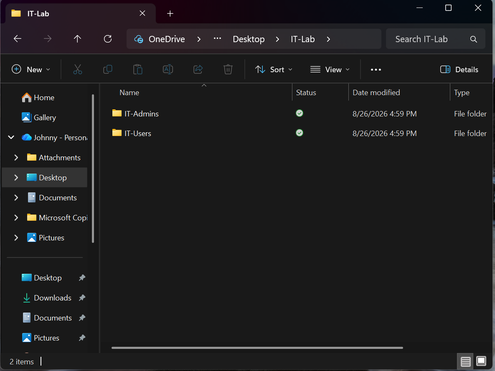
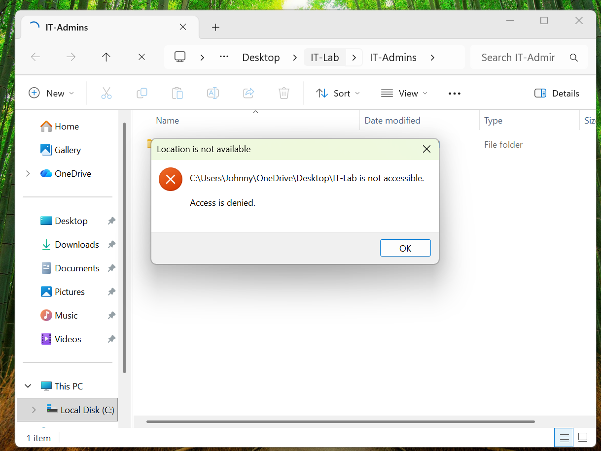

# Lab 02 - Windows groups & Files Permissions
## Objective

Practice managing Windows users, groups, and file/folder permission

#Environment

- Windows 11
- Local Windows accounts
- NTFS file permissions

## Evidence

### Folder Structure

### Users

### Groups

### Permissions

### Access Test

### Access Results

| Accounts | IT-Users | IT-Admins |
|---|---|---|
| ITUser | Allowed | Denied|
| ITAdmin | Denied | Allowed|

## What i learned

This lab helped me understand how window security groups can be used to mange access to files and folder.
Instead of assigning permission individually to each users. Permission can be assigned to groups and users can be managed through their group member ship.

## Skills Practiced

- Windows users mangement
- Windows security groups
- NTFS permission
- Access control
- Group-based permissions
- Permission testing
- Basic troubleshooting
